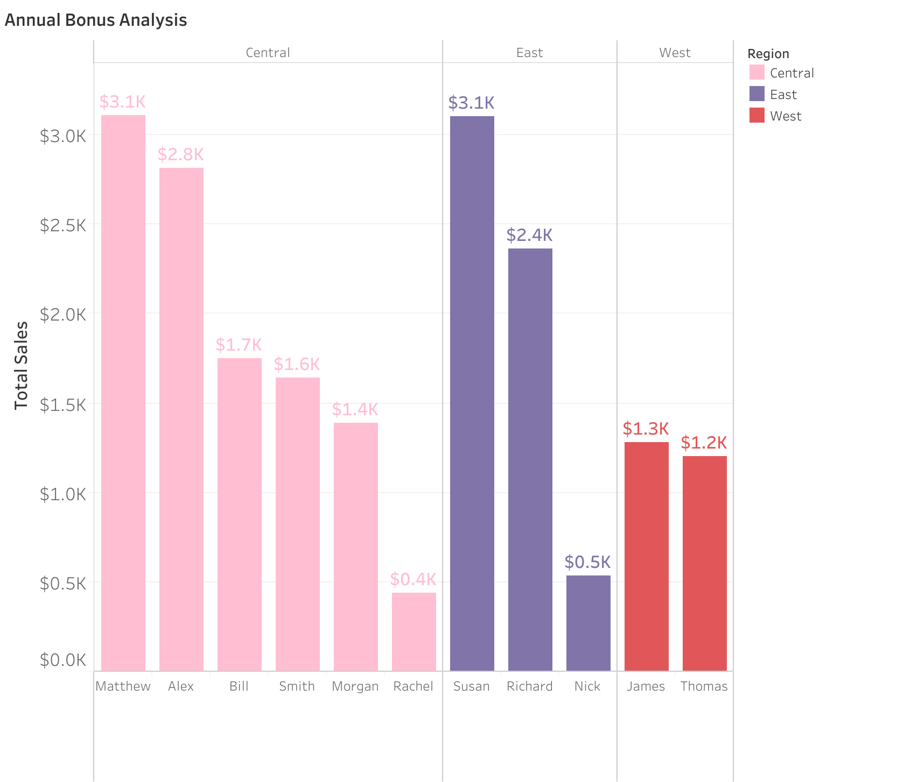
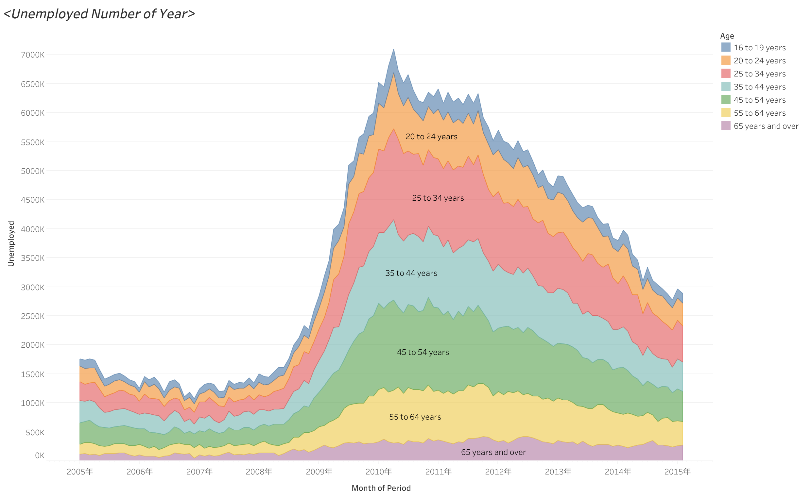

# 📊 Tableau Business Intelligence Dashboards

Welcome to my interactive data visualization showcase! This repository stores the architectural roadmaps, documentation, and executive summaries for business dashboards I design using Tableau.

## 📈 Active Projects

### 1. Core Operational Metrics (In Progress 🛠️)
*A dynamic evaluation tracking fundamental business dimensions and categorical comparative breakdowns.*

#### 🔍 Visual Preview
> **Note**: I just built my very first structural bar chart for this pipeline! Below is a glimpse of the initial layout. More interactive elements and complex calculated fields are actively being stacked on top.

---

## 🛠️ Design Philosophy
- **Actionable Insight**: Prioritizing clean visual hierarchies so stakeholders can extract key trends within 5 seconds.
- **Data Integrity**: Ensuring proper data types, alias mapping, and aggregation consistency across all worksheets.
- **Figma Synergy**: Planning to blend customized UI containers from Figma to elevate the user experience.

---
*Updated dynamically alongside my Tableau A-Z mastering track.*
